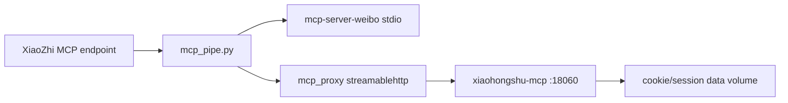

# Social MCP Integration Plan

Last reviewed: 2026-06-09

## Goal

Integrate these two MCP services into the existing cloud-hosted XiaoZhi MCP bridge:

- Weibo: <https://github.com/qinyuanpei/mcp-server-weibo>
- Xiaohongshu: <https://github.com/xpzouying/xiaohongshu-mcp>

The bridge must keep StackChan official firmware unchanged. All changes stay in the cloud bridge and MCP server configuration.

## Design Summary

### Weibo

Use `qinyuanpei/mcp-server-weibo` as a stdio child MCP server.

Reasons:

- It is a real MCP server.
- It supports `uvx`.
- It exposes read-oriented tools: user search, profile, feeds, hot feeds, trendings, content search, topic search, followers/fans, comments.
- It does not require a user-managed Weibo login cookie for the basic access path; its README describes automatic visitor credential handling.

Production config:

```json
"weibo": {
  "type": "stdio",
  "command": "uvx",
  "args": [
    "--from",
    "mcp-server-weibo==1.1.0",
    "mcp-server-weibo",
    "stdio"
  ]
}
```

The PyPI package is pinned to `1.1.0` so production does not silently float to a new release.

### Xiaohongshu

Use `xpzouying/xiaohongshu-mcp` as a separately deployed HTTP MCP server and connect the bridge to its streamable HTTP endpoint.

Reasons:

- It is the most mature self-hosted Xiaohongshu MCP option found.
- It has Docker support and exposes `http://localhost:18060/mcp`.
- It supports the required search/detail/profile workflows.

Risk boundary:

- The upstream service includes write tools such as publish, comment, reply, like, and favorite.
- The bridge therefore enforces a local tool allowlist before exposing the service to XiaoZhi.
- Login and cookie management are treated as admin setup operations, not voice-assistant tools.

Production config:

```json
"xiaohongshu-mcp": {
  "type": "streamablehttp",
  "url": "${XIAOHONGSHU_MCP_URL}",
  "enabledIfEnv": "XIAOHONGSHU_MCP_URL",
  "allowedTools": [
    "check_login_status",
    "list_feeds",
    "search_feeds",
    "get_feed_detail",
    "user_profile"
  ]
}
```

`XIAOHONGSHU_MCP_URL` should normally be:

```dotenv
XIAOHONGSHU_MCP_URL=http://127.0.0.1:18060/mcp
```

## Tool Policy

The bridge now supports:

- `allowedTools`: only these tools are visible and callable.
- `blockedTools`: these tools are hidden and blocked.

For Xiaohongshu, use `allowedTools` instead of `blockedTools`. This is safer because any new write tool added upstream will remain hidden until explicitly reviewed.

Allowed Xiaohongshu tools:

- `check_login_status`
- `list_feeds`
- `search_feeds`
- `get_feed_detail`
- `user_profile`

Intentionally not exposed:

- `get_login_qrcode`
- `delete_cookies`
- `publish_content`
- `publish_with_video`
- `post_comment_to_feed`
- `reply_comment_in_feed`
- `like_feed`
- `favorite_feed`

## Xiaohongshu Deployment

Recommended production shape:



Deploy `xpzouying/xiaohongshu-mcp` separately from the bridge:

```bash
docker pull xpzouying/xiaohongshu-mcp
wget https://raw.githubusercontent.com/xpzouying/xiaohongshu-mcp/main/docker/docker-compose.yml
docker compose up -d
docker compose logs -f
```

Then complete login as an admin-only operation. Do not expose login, cookie deletion, or publishing tools through XiaoZhi.

After the service is reachable:

```bash
XIAOHONGSHU_MCP_URL=http://127.0.0.1:18060/mcp \
  .venv/bin/python scripts/smoke_mcp_server.py xiaohongshu-mcp
```

Expected bridge-visible tools:

```text
check_login_status
list_feeds
search_feeds
get_feed_detail
user_profile
```

Verify that a write tool is blocked locally:

```bash
XIAOHONGSHU_MCP_URL=http://127.0.0.1:18060/mcp \
  .venv/bin/python scripts/call_mcp_tool.py xiaohongshu-mcp publish_content --arguments '{}'
```

Expected result:

```text
Call failed: Tool is not allowed by bridge policy: publish_content
```

## Weibo Verification

List bridge-visible tools:

```bash
.venv/bin/python scripts/smoke_mcp_server.py weibo --timeout-seconds 180
```

Call one read tool:

```bash
.venv/bin/python scripts/call_mcp_tool.py weibo get_trendings --arguments '{"limit":1}' --timeout-seconds 180
```

## Full Bridge Verification

Run preflight:

```bash
.venv/bin/python scripts/preflight.py
```

Start a single server through the XiaoZhi bridge:

```bash
.venv/bin/python mcp_pipe.py weibo
```

Start all enabled servers:

```bash
.venv/bin/python mcp_pipe.py
```

With the current config:

- Volcengine search is enabled when `VOLCENGINE_SEARCH_API_KEY` is set.
- Weibo is enabled by default.
- Xiaohongshu is enabled only when `XIAOHONGSHU_MCP_URL` is set.

## Acceptance Criteria

The integration is complete when:

1. Unit tests pass.
2. `mcp_config.json` validates as JSON.
3. `scripts/preflight.py` passes.
4. `scripts/smoke_mcp_server.py weibo` lists Weibo tools.
5. `scripts/call_mcp_tool.py weibo get_trendings --arguments '{"limit":1}'` returns data.
6. If `XIAOHONGSHU_MCP_URL` is configured and the Xiaohongshu service is running, `scripts/smoke_mcp_server.py xiaohongshu-mcp` lists only allowed tools.
7. Xiaohongshu write tools are blocked by bridge policy.
8. `mcp_pipe.py` can connect to `MCP_ENDPOINT` and expose the enabled tools to XiaoZhi.

