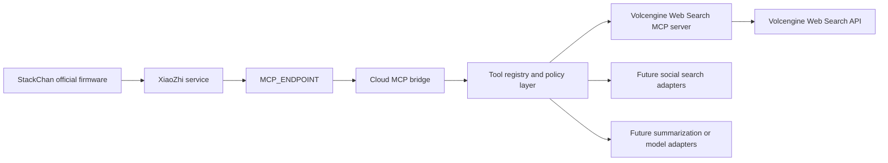

# Volcengine Agent Plan MCP Architecture and Deployment Plan

Last reviewed: 2026-06-09

## Goal

Build a maintainable XiaoZhi/StackChan MCP bridge that keeps the official StackChan firmware unchanged, runs on our cloud server, connects to the existing `MCP_ENDPOINT`, and exposes useful tools such as Volcengine web search through MCP.

The first production tool should be Volcengine Web Search MCP. The architecture must also support future providers such as Weibo, Xiaohongshu, general web search, image search, document search, and summarization without rewriting the bridge.

## Source Documents

- Volcengine Agent Plan quick start: <https://www.volcengine.com/docs/82379/2373738?lang=zh>
- Volcengine Agent Plan other tools: <https://www.volcengine.com/docs/82379/2373746?lang=zh>
- Volcengine Agent Plan vision model usage: <https://www.volcengine.com/docs/82379/2375486?lang=zh>
- Volcengine web search beta: <https://www.volcengine.com/docs/82379/2301412?lang=zh>
- Volcengine web search billing: <https://www.volcengine.com/docs/87772/2272951?lang=zh>
- Volcengine official MCP server repository: <https://github.com/volcengine/mcp-server/tree/main/server/mcp_server_askecho_search_infinity>

## Important Official Findings

1. Agent Plan and Coding Plan are different products. Agent Plan has its own dedicated API key and base URL. Do not use the normal Volcengine API key or Coding Plan API key for Agent Plan model calls.
2. Agent Plan supports Anthropic-compatible and OpenAI-compatible protocols. For OpenAI-compatible clients, the documented Agent Plan base URL is `https://ark.cn-beijing.volces.com/api/plan/v3`.
3. Volcengine web search supports Skill mode and MCP Server mode. For this project, MCP Server mode is the correct integration point because StackChan already reaches tools through XiaoZhi MCP.
4. Agent Plan personal plans include limited free web-search calls. The documented monthly free quota is plan dependent: Small 50, Medium 150, Large 400, Max 800 calls per month. Free quota resets monthly on the 1st, and overage must be explicitly enabled in the console.
5. Volcengine also offers standalone web-search subscription packages that are friendlier for personal developers than pure pay-as-you-go:
   - Light package: 1000 calls total, daily limit 50, 1 month, 5.9 RMB.
   - Explore package: 2000 calls total, daily limit 100, 1 month, 9.9 RMB.
   - Pay-as-you-go web search is documented as 0.020 RMB per call.
6. The official Volcengine web-search MCP server is named `mcp-server-askecho-search-infinity`. It exposes a `web_search` tool with query, count, search type, time range, and authority-level parameters.
7. The official server supports API-key auth and AK/SK auth. For this project, prefer the web-search API key path because it is simpler and keeps search billing separate from model credentials.
8. The official server requires Python `>=3.12,<3.14` and is commonly launched through `uvx`.

## Target Architecture



The bridge should remain a transport/process-management layer. It should not contain provider-specific API logic unless a provider has no mature MCP server or SDK. Provider details belong behind small adapters or external MCP servers.

## Recommended Product Choice

Use Volcengine Agent Plan plus Volcengine Web Search MCP as the first implementation.

Reasons:

- It is officially supported by Volcengine and has an official MCP server.
- It fits the user's current purchase decision.
- It offers quota and subscription-style packages, which are easier to control than pure per-call billing.
- It avoids building a web crawler or search backend ourselves.
- It can be placed behind the existing cloud bridge without reflashing StackChan.

For immediate use, choose this priority:

1. Use Agent Plan included free web-search quota while testing.
2. If usage becomes regular, buy the standalone web-search subscription package and use its dedicated search API key.
3. Keep pay-as-you-go overage disabled by default unless explicitly needed.

## Environment Contract

Secrets should live in `.env` and should never be committed or copied into logs.

Recommended variables:

```dotenv
# XiaoZhi bridge endpoint. Already provided locally.
MCP_ENDPOINT=

# Agent Plan model access. Keep separate from search credentials.
VOLCENGINE_AGENT_PLAN_API_KEY=
VOLCENGINE_AGENT_PLAN_BASE_URL=https://ark.cn-beijing.volces.com/api/plan/v3

# Preferred web-search credential for the official MCP server.
VOLCENGINE_SEARCH_API_KEY=

# Optional fallback if we choose AK/SK auth instead of a search API key.
VOLCENGINE_ACCESS_KEY=
VOLCENGINE_SECRET_KEY=

# Local budget controls. These are bridge-side limits, not provider billing limits.
VOLCENGINE_SEARCH_DAILY_LIMIT=50
VOLCENGINE_SEARCH_MONTHLY_LIMIT=1000
VOLCENGINE_SEARCH_ALLOW_OVERAGE=false

# Runtime behavior.
MCP_LOG_LEVEL=INFO
MCP_CONFIG_PATH=./mcp_config.json
```

The official Volcengine MCP server expects the search API key in `ASK_ECHO_SEARCH_INFINITY_API_KEY`. The bridge should map our internal `VOLCENGINE_SEARCH_API_KEY` into that child-process environment variable.

## MCP Server Configuration

The eventual `mcp_config.json` should describe tools declaratively and avoid hardcoded secrets.

Target shape:

```json
{
  "mcpServers": {
    "volcengine-web-search": {
      "enabled": true,
      "transport": "stdio",
      "command": "uvx",
      "args": [
        "--from",
        "git+https://github.com/volcengine/mcp-server@69d102e079ca74acedd5ec48eeeb24b148efb36e#subdirectory=server/mcp_server_askecho_search_infinity",
        "mcp-server-askecho-search-infinity"
      ],
      "env": {
        "ASK_ECHO_SEARCH_INFINITY_API_KEY": "${VOLCENGINE_SEARCH_API_KEY}"
      },
      "policy": {
        "dailyLimit": "${VOLCENGINE_SEARCH_DAILY_LIMIT}",
        "monthlyLimit": "${VOLCENGINE_SEARCH_MONTHLY_LIMIT}",
        "allowOverage": "${VOLCENGINE_SEARCH_ALLOW_OVERAGE}"
      }
    }
  }
}
```

Current code should not be assumed to support `${ENV_VAR}` interpolation yet. Add this before putting placeholders into production config.

## Code Design

The repository should evolve from a single bridge script into a small, layered Python package. Keep the current public entrypoint, but move responsibilities into cohesive modules.

Suggested structure:

```text
mcp_bridge/
  __init__.py
  app.py                 # high-level startup orchestration
  config.py              # typed config loading, env interpolation, validation
  secrets.py             # redaction helpers, no secret retrieval side effects
  server_registry.py     # MCP server definitions and enable/disable logic
  process_manager.py     # stdio child process lifecycle and restart behavior
  transports.py          # stdio, sse, http, streamable-http command builders
  policy.py              # quota, rate limit, and allow/deny decisions
  logging.py             # structured logging setup
  health.py              # health and readiness checks
tests/
  test_config.py
  test_server_registry.py
  test_process_manager.py
  test_policy.py
mcp_pipe.py              # thin compatibility entrypoint
```

Responsibilities:

- `mcp_pipe.py`: parse minimal CLI/env, call `mcp_bridge.app.run()`.
- `config.py`: load `.env`, load JSON config, expand env placeholders, validate required fields, produce typed objects.
- `server_registry.py`: decide which servers are enabled and expose sanitized metadata for logs.
- `process_manager.py`: start/stop/restart child MCP servers, handle stderr/stdout safely, enforce timeouts.
- `transports.py`: build commands for stdio, SSE, HTTP, and streamable HTTP without mixing provider logic.
- `policy.py`: enforce local daily/monthly limits and optional cache rules before expensive tools are called.
- `secrets.py`: redact keys in logs and errors.

Use existing libraries where they are mature:

- `python-dotenv` for `.env`.
- `pydantic` or `pydantic-settings` for typed config and validation.
- `mcp` / `fastmcp` for MCP protocol work.
- `mcp-proxy` for transport proxying instead of writing protocol glue.
- `uv` / `uvx` for running official MCP servers.
- `pytest` for logic tests.
- `structlog` or standard `logging` with JSON formatting for production logs.

Avoid:

- Hand-rolled web-search API clients before exhausting official MCP/server options.
- Hardcoded provider secrets inside JSON config.
- A single large script that mixes config parsing, process management, provider policy, and transport wiring.
- Publicly exposing an unauthenticated MCP HTTP endpoint on the server.

## Implementation Phases

### Phase 0: Baseline Verification

Purpose: confirm the current bridge and server environment before changes.

Checklist:

- Confirm Python is 3.12 or 3.13 on the server.
- Confirm `.env` contains `MCP_ENDPOINT`.
- Install project dependencies in a virtual environment.
- Install `uv` so `uvx` is available.
- Run current bridge once and confirm it connects to XiaoZhi.
- Record current `mcp_config.json` behavior.

Expected result: we know whether the current bridge can start, and we know what must change before adding Volcengine search.

### Phase 1: Configuration and Secret Hygiene

Purpose: make configuration safe and extensible.

Work:

- Add typed config loading with Pydantic.
- Add `${ENV_VAR}` interpolation for JSON config values.
- Validate required env values before launching child processes.
- Add secret redaction for logs and exception messages.
- Add clear errors for missing `MCP_ENDPOINT`, missing command, missing API key, or unsupported transport.

Tests:

- Env interpolation succeeds for simple and nested values.
- Missing required env variables fail with actionable errors.
- Secret values are redacted in log strings.
- Disabled MCP servers are ignored.

### Phase 2: Official Volcengine Web Search MCP

Purpose: integrate Volcengine web search without custom API code.

Work:

- Add `volcengine-web-search` server definition to config.
- Map `VOLCENGINE_SEARCH_API_KEY` to `ASK_ECHO_SEARCH_INFINITY_API_KEY`.
- Support `uvx` launch.
- Pin the MCP server source to a known tag or commit when available. If no stable tag is available, record the commit hash used in deployment documentation.
- Add a smoke test script that starts only the web-search MCP server and lists available tools.
- Add a manual smoke command for one low-cost query.

Tests:

- Command builder creates the expected `uvx` command.
- Child environment contains only intended variables.
- Startup fails clearly if `uvx` is missing.
- Integration smoke is skipped unless `VOLCENGINE_SEARCH_API_KEY` is set.

### Phase 3: Policy Layer

Purpose: avoid accidental quota or billing surprises.

Work:

- Add local daily and monthly counters.
- Add `allowOverage=false` default.
- Add optional short TTL cache for identical search requests.
- Add per-tool timeout and max-result defaults.
- Add output-size guardrails for voice usage.

Recommended defaults:

- `Count=5` for voice queries.
- Search timeout: 10-15 seconds.
- Cache TTL: 10-30 minutes for identical query/time-range/search-type.
- Daily local limit should be less than or equal to the purchased package daily limit.

Tests:

- Daily cap blocks after threshold.
- Monthly cap blocks after threshold.
- Overage disabled blocks requests after local limit.
- Cache hit does not increment provider call counter.

### Phase 4: Production Deployment

Purpose: make the bridge stable on the cloud server.

Server setup:

```bash
sudo useradd --system --create-home --home /opt/xiaozhi-mcp xiaozhi-mcp
sudo mkdir -p /opt/xiaozhi-mcp
sudo chown -R xiaozhi-mcp:xiaozhi-mcp /opt/xiaozhi-mcp
```

Python setup:

```bash
cd /opt/xiaozhi-mcp
python3.12 -m venv .venv
. .venv/bin/activate
pip install -U pip
pip install -r requirements.txt
```

`requirements.txt` includes `uv`, so `uvx` is available from the virtual environment after dependency installation. If the server standardizes on a global `uv` installation, the official installer is also acceptable:

```bash
curl -LsSf https://astral.sh/uv/install.sh | sh
```

Environment:

```bash
sudo install -o xiaozhi-mcp -g xiaozhi-mcp -m 600 .env /opt/xiaozhi-mcp/.env
```

Systemd unit is checked into the repository at `deploy/xiaozhi-mcp.service`:

```ini
[Unit]
Description=XiaoZhi MCP Bridge
After=network-online.target
Wants=network-online.target

[Service]
Type=simple
User=xiaozhi-mcp
Group=xiaozhi-mcp
WorkingDirectory=/opt/xiaozhi-mcp
EnvironmentFile=/opt/xiaozhi-mcp/.env
ExecStart=/opt/xiaozhi-mcp/.venv/bin/python /opt/xiaozhi-mcp/mcp_pipe.py
Restart=always
RestartSec=5
NoNewPrivileges=true
PrivateTmp=true

[Install]
WantedBy=multi-user.target
```

Operations:

```bash
sudo systemctl daemon-reload
sudo systemctl enable --now xiaozhi-mcp
sudo systemctl status xiaozhi-mcp
journalctl -u xiaozhi-mcp -f
```

Before enabling the service, run:

```bash
/opt/xiaozhi-mcp/.venv/bin/python /opt/xiaozhi-mcp/scripts/preflight.py
```

After `VOLCENGINE_SEARCH_API_KEY` is configured, verify that the official search MCP server starts and exposes tools:

```bash
/opt/xiaozhi-mcp/.venv/bin/python /opt/xiaozhi-mcp/scripts/smoke_volcengine_search.py
```

Then run one quota-consuming real search query if an end-to-end API validation is required:

```bash
/opt/xiaozhi-mcp/.venv/bin/python /opt/xiaozhi-mcp/scripts/query_volcengine_search.py "今日火山引擎 Agent Plan 联网搜索"
```

### Phase 5: Future Providers

Purpose: add more search sources without changing the bridge core.

Future providers should be added as MCP servers or small provider adapters behind the same registry and policy interface.

Provider categories:

- General web search: Volcengine first, optional Tavily/SerpAPI/Bing/Kimi/other MCP later if needed.
- Social search: Weibo and Xiaohongshu are harder because official stable public search APIs are limited. Prefer official partner APIs, enterprise services, or compliant third-party data providers. Avoid scraping unless legal, account, and anti-abuse risks are explicitly accepted.
- Content summarization: use Agent Plan model calls only after search results are retrieved and policy allows additional model cost.
- Personal knowledge sources: Notion, Feishu, local documents, and private databases can be separate MCP servers.

All future providers should declare:

- `provider`
- `toolName`
- `authMode`
- `costModel`
- `dailyLimit`
- `monthlyLimit`
- `timeoutSeconds`
- `outputPolicy`
- `enabled`

This keeps budget, observability, and XiaoZhi-facing behavior consistent.

## Runtime and Security Rules

1. Do not log API keys, AK/SK, endpoint tokens, or raw `.env`.
2. Do not expose child MCP servers directly to the public internet.
3. Keep the bridge as the only component that connects to `MCP_ENDPOINT`.
4. Keep provider MCP servers as child processes by default. This reduces public attack surface.
5. Pin dependencies for production. Avoid relying on unpinned GitHub HEAD at service startup.
6. Keep `.env` permission at `600`.
7. Add restart backoff and clear startup errors.
8. Add a safe degraded mode: if Volcengine search fails, the bridge should stay alive and report tool failure rather than crashing all tools.

## Testing Strategy

Focus on logic tests.

Required tests:

- Config parsing and validation.
- Env placeholder interpolation.
- Secret redaction.
- Command construction for stdio, SSE, HTTP, and streamable HTTP.
- Enabled/disabled server filtering.
- Policy counters and overage blocking.
- Child process startup failure handling.

Optional integration tests:

- Start Volcengine search MCP server and list tools.
- Run one real `web_search` call only when `VOLCENGINE_SEARCH_API_KEY` is present and an explicit integration flag is enabled.

Avoid UI tests. This project is a server-side bridge; browser/UI tests add little value.

## Observability

Production logs should include:

- Bridge startup and version.
- Config file path.
- Enabled MCP server names.
- Child process start/stop/restart events.
- Tool call provider, tool name, duration, success/failure, and error category.
- Quota decisions: allowed, blocked by local daily cap, blocked by monthly cap, cache hit.

Production logs should not include:

- Full query history unless explicitly enabled.
- Raw search results unless debugging locally.
- Secrets or endpoint tokens.

Recommended metrics, even if implemented as logs first:

- `mcp_bridge_connected`
- `mcp_child_process_running`
- `mcp_tool_call_total`
- `mcp_tool_call_failed_total`
- `mcp_tool_call_duration_ms`
- `mcp_policy_block_total`
- `mcp_cache_hit_total`

## Deployment Acceptance Criteria

The deployment is acceptable when:

1. The bridge starts under systemd after reboot.
2. `journalctl` shows no secrets.
3. XiaoZhi can see the Volcengine web-search tool.
4. StackChan can ask a simple current-information question and receive a useful result.
5. Local daily/monthly policy limits are active.
6. If the Volcengine search key is removed, startup fails clearly or the tool is disabled clearly.
7. Unit tests pass.
8. Integration smoke is documented and can be run manually.

## Immediate Next Steps

1. Refactor current bridge into a package with typed config while keeping `mcp_pipe.py` as the entrypoint.
2. Add env interpolation and secret redaction.
3. Add the Volcengine web-search server config using the official MCP server.
4. Add unit tests for config, command building, and policy.
5. Install `uv` and verify `uvx` on the server.
6. Run an integration smoke test with `VOLCENGINE_SEARCH_API_KEY`.
7. Deploy through systemd.
8. Confirm StackChan can call the search tool through XiaoZhi.
